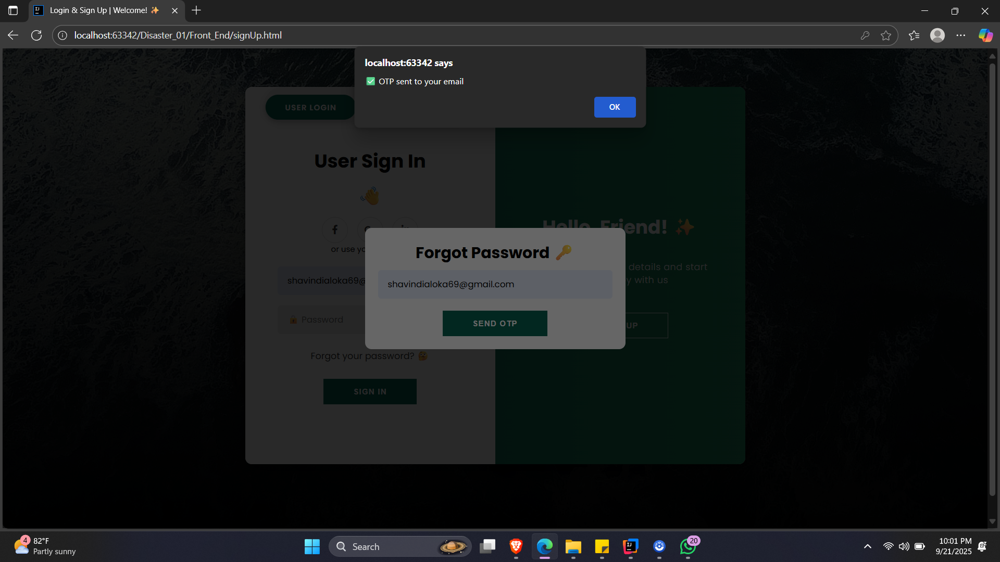
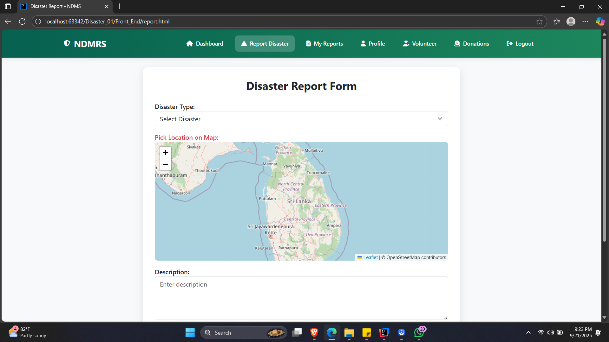

# 🌪️ Natural Disaster Management and Response System (NDMRS)

---

## 📖 Project Description
The **Natural Disaster Management and Response System (NDMRS)** is a **centralized web-based platform** that streamlines the management of natural disaster events in Sri Lanka.  
It provides a **faster, organized, and accountable disaster response mechanism** by enabling:

- ✅ **Rapid victim registration**
- ✅ **Efficient aid distribution**
- ✅ **Real-time volunteer coordination**
- ✅ **Transparent donation tracking**


### ⚡ Key Features
- 👤 **Role-based User Registration & Login** (Admin, Victim, Volunteer, Donor)
- 📊 **Admin Dashboard**: Manage disaster events, victims, resources, volunteers, and donations
- 📝 **Victim Disaster Report Submission**
- 🌍 **Disaster Event Creation & Monitoring**
- 💰 **Resource & Donation Management** (Add / Update / Allocate)
- 🤝 **Volunteer Registration & Task Assignment**
- 📈 **Reports & Visual Dashboards**
- 📲 **Notification / Email Alerts**


### 🛠️ Technologies Used
- **Frontend:** HTML, CSS, Bootstrap, JavaScript, jQuery
- **Backend:** Java, Spring Boot, Spring Security (JWT)
- **Database:** MySQL
- **Other Tools / APIs:**
    - Postman (API testing)
    - Swagger (API documentation)
    - Lombok (boilerplate reduction)
    - Git & GitHub (version control)
    - Map API (for disaster location mapping)
    - Weather API (real-time weather data for disaster management)
    - Email API (for SMS / Email alerts to users)


## 📸 Project Screenshots

### 🏠 Home Page


### 🔑 Live Weather Page


### 🔑Login Page





### 🔑Sign Up Page


## 📸 User Dashboard UI Screenshots

### 📊 User Dashboard


### 📊 Add Disaster Report Page


### 📊 My Disaster Report Page


### 📊 User Profile Page


### 📊 Donation Page


## 📸 Admin Dashboard UI Screenshots

### 📊 Admin Dashboard


### 📊 Manage Volunteer Page


### 📊 Manage Donor Page


### 📊 Manage User Page


### 📊 Reports In Week Page


### 📊  Reports & Responses Page 


### 📊 Allocate Donation Page


### 📊 Notification Page


## 📸 Volunteer Dashboard UI Screenshots

### 📊 Volunteer Dashboard


### 📊 Manage Volunteer Response Page


### 📊 Manage Volunteer Profile Page


## ⚙️ Setup Instructions

### 🛠️ Prerequisites
Before starting, make sure you have the following installed:

- ☕ **Java 21 JDK** – required for the Spring Boot backend
- 🌱 **Spring Boot 3.x+** – included via Maven dependencies (no separate install needed)
- 🐬 **MySQL 8.0+** – create a database, e.g., `ndmrs_db`
- 🛠️ **Maven 3.8+** – for building the backend
- 🔗 **Git** – for cloning the repository
- 🌐 **HTML,CSS,JS** – required to run the frontend (if using npm for dependencies)


### ⚙️ Backend Setup (Spring Boot)

1. **Clone the repository**
```bash
git clone https://github.com/your-username/ndmrs-api.git
cd ndmrs-api/backend

```

2. **Navigate to backend folder**
```bash
cd ndmrs-api/backend

```

3. **Create uploads folder and copy default profile image**
```bash
mkdir uploads
cp ../frontend/images/default-profile.png uploads/


```

4. **Configure application.properties**
```bash
spring.application.name=Back_End

# ===============================
# Database Settings
# ===============================
spring.datasource.driver-class-name=com.mysql.cj.jdbc.Driver
spring.datasource.username=root
spring.datasource.password=your-db-password
spring.datasource.url=jdbc:mysql://localhost:3306/disaster01?createDatabaseIfNotExist=true
spring.datasource.hikari.maximum-pool-size=10

# ===============================
# JPA Settings
# ===============================
spring.jpa.generate-ddl=true
spring.jpa.show-sql=true
spring.jpa.database-platform=org.hibernate.dialect.MySQLDialect
spring.jpa.hibernate.ddl-auto=update

# ===============================
# JWT Configuration
# ===============================
jwt.secretKey=your-secure-key
jwt.expiration=864000000

# ===============================
# File Upload
# ===============================
report.setPhotoPath("uploads/" + fileName);

# ===============================
# Gmail SMTP Configuration
# ===============================
spring.mail.host=smtp.gmail.com
spring.mail.port=587
spring.mail.username=your-email@gmail.com
spring.mail.password=your-app-password
spring.mail.properties.mail.smtp.auth=true
spring.mail.properties.mail.smtp.starttls.enable=true
spring.mail.properties.mail.smtp.starttls.required=true
spring.mail.properties.mail.debug=true

# ===============================
# Spring Multipart Settings
# ===============================
spring.servlet.multipart.max-file-size=10MB
spring.servlet.multipart.max-request-size=10MB


```

5. **Build and run backend**
```bash
mvn clean install
mvn spring-boot:run

```

6. **Build and run backend**
```bash
http://localhost:8080/api

```

### 🌐 Frontend Setup (Static HTML/CSS/JS)

1. **Navigate to frontend folder**
```bash
cd ../frontend
```

2. **Run a local development server**
```bash
npx http-server -p 8081
```

3. **Access the frontend**
   Open your browser and go to:
```bash
http://localhost:8081
```

**Pages Included:**
- `dashboard.html` – Home
- `signUp.html` – Login form
- `userDashboard.html` – Victim disaster report and tracking
- `volunteerDashboard.html` – Volunteer tasks and responses
- `adminDashboard.html` – Admin management, resource allocation, reports etc.

**Key Files:**
- `js/scripts.js` – Handles API calls and JWT functionality
- `css/styles.css` – Contains styling for the frontend

## 📂 Project Structure

```
Disaster_01/
│── Back_End/ # Spring Boot backend
│ ├── src/
│ │ ├── main/
│ │ │ ├── java/com/ijse/gdse/back_end/
│ │ │ │ ├── config/ # Security & JWT configuration
│ │ │ │ ├── controller/ # REST controllers
│ │ │ │ ├── dto/ # Data Transfer Objects
│ │ │ │ ├── entity/ # JPA Entities
│ │ │ │ ├── exception/ # Custom exceptions
│ │ │ │ ├── repository/ # Spring Data JPA repositories
│ │ │ │ ├── service/ # Service layer
│ │ │ │ └── util/ # Utility classes
│ │ │ └── resources/ # application.properties, static, templates
│ ├── pom.xml # Maven dependencies
│ └── target/ # Build output
│
│── Front_End/ # Static frontend
│ ├── css/ # Stylesheets
│ ├── js/ # JavaScript files
│ ├── images/ # Images
│ ├── videos/ # Videos
│ ├── dashboard.html # Home page
│ ├── signUp.html # Registration page
│ ├── userDashboard.html # Victim dashboard
│ ├── volunteerDashboard.html # Volunteer dashboard
│ ├── adminDashboard.html # Admin dashboard
│ ├── donation.html # Donation page
│ ├── report.html # Disaster report page
│ ├── maps.html # Disaster location map
│ └── ... (other HTML pages)
│
│── uploads/ # Uploaded files & screenshots
│── README.md # Documentation
│── .gitignore
```

## 🎥 Project Demo (YouTube)

👉 [Watch Demo Video](https://www.youtube.com/watch?v=https://youtu.be/i8albo3oQt0?si=GScDN4dxDB6RUepf)
